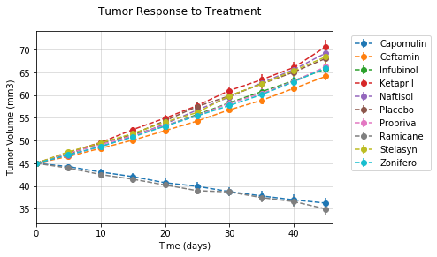
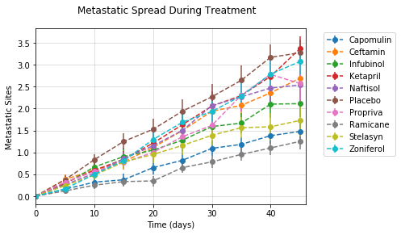
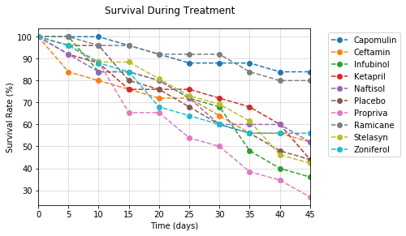
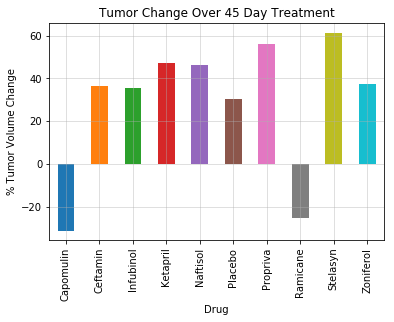

## Pymaceuticals Inc.

#### Analysis
- The data indicate that Capomulin and Ramicane were the most effective treatments, with treatment with Capomulin resulting in a 31.1% reduction in tumor volume and an 84% survival rate at 45 days, and treatment with Ramicane resulting in a 25.4% reduction in tumor volume and an 80% survival rate at 45 days.
- Propriva and Stelasyn appear to be the least effective treatments, with treatment with Propriva resulting in a 55.9% increase in tumor volume and a survival rate of 26.9% at 45 days, and treatment with Stelasyn resulting in a 61.2% increase in tumor volume and a survival rate of 42.3% at 45 days.
- Propriva, Infubinol, Stelasyn, and Ketabril all had survival rates below that of the placebo condition at 45 days, indicating that these treatments may be more detrimental than helpful in the treatment of cancer.


```python
import matplotlib.pyplot as plt
import pandas as pd
import seaborn as sb
import numpy as np
from scipy.stats import sem
```


```python
# Import data
clinical_trial_data = "raw_data/clinicaltrial_data.csv"
clinical_df = pd.read_csv(clinical_trial_data)

mouse_drug_data = "raw_data/mouse_drug_data.csv"
mouse_df = pd.read_csv(mouse_drug_data)
```


```python
print(len(clinical_df))
clinical_df.head()
```

    1893


<div>
<style scoped>
    .dataframe tbody tr th:only-of-type {
        vertical-align: middle;
    }

    .dataframe tbody tr th {
        vertical-align: top;
    }

    .dataframe thead th {
        text-align: right;
    }
</style>
<table border="1" class="dataframe">
  <thead>
    <tr style="text-align: right;">
      <th></th>
      <th>Mouse ID</th>
      <th>Timepoint</th>
      <th>Tumor Volume (mm3)</th>
      <th>Metastatic Sites</th>
    </tr>
  </thead>
  <tbody>
    <tr>
      <th>0</th>
      <td>b128</td>
      <td>0</td>
      <td>45.0</td>
      <td>0</td>
    </tr>
    <tr>
      <th>1</th>
      <td>f932</td>
      <td>0</td>
      <td>45.0</td>
      <td>0</td>
    </tr>
    <tr>
      <th>2</th>
      <td>g107</td>
      <td>0</td>
      <td>45.0</td>
      <td>0</td>
    </tr>
    <tr>
      <th>3</th>
      <td>a457</td>
      <td>0</td>
      <td>45.0</td>
      <td>0</td>
    </tr>
    <tr>
      <th>4</th>
      <td>c819</td>
      <td>0</td>
      <td>45.0</td>
      <td>0</td>
    </tr>
  </tbody>
</table>
</div>


```python
print(len(mouse_df))
mouse = mouse_df.set_index('Mouse ID')
# mouse_df.head()
mouse.head()
```

    250


<div>
<style scoped>
    .dataframe tbody tr th:only-of-type {
        vertical-align: middle;
    }

    .dataframe tbody tr th {
        vertical-align: top;
    }

    .dataframe thead th {
        text-align: right;
    }
</style>
<table border="1" class="dataframe">
  <thead>
    <tr style="text-align: right;">
      <th></th>
      <th>Drug</th>
    </tr>
    <tr>
      <th>Mouse ID</th>
      <th></th>
    </tr>
  </thead>
  <tbody>
    <tr>
      <th>f234</th>
      <td>Stelasyn</td>
    </tr>
    <tr>
      <th>x402</th>
      <td>Stelasyn</td>
    </tr>
    <tr>
      <th>a492</th>
      <td>Stelasyn</td>
    </tr>
    <tr>
      <th>w540</th>
      <td>Stelasyn</td>
    </tr>
    <tr>
      <th>v764</th>
      <td>Stelasyn</td>
    </tr>
  </tbody>
</table>
</div>


```python
# Bar graph that compares the total % tumor volume change for each drug across the full 45 days.
```


```python
# Merge datasets / add 'drug' column to clinical data
pymaceutical_df = clinical_df.merge(mouse_df, how='left', on='Mouse ID')
data = clinical_df.merge(mouse_df, how='left', on='Mouse ID')
data.head()
```


<div>
<style scoped>
    .dataframe tbody tr th:only-of-type {
        vertical-align: middle;
    }

    .dataframe tbody tr th {
        vertical-align: top;
    }

    .dataframe thead th {
        text-align: right;
    }
</style>
<table border="1" class="dataframe">
  <thead>
    <tr style="text-align: right;">
      <th></th>
      <th>Mouse ID</th>
      <th>Timepoint</th>
      <th>Tumor Volume (mm3)</th>
      <th>Metastatic Sites</th>
      <th>Drug</th>
    </tr>
  </thead>
  <tbody>
    <tr>
      <th>0</th>
      <td>b128</td>
      <td>0</td>
      <td>45.0</td>
      <td>0</td>
      <td>Capomulin</td>
    </tr>
    <tr>
      <th>1</th>
      <td>f932</td>
      <td>0</td>
      <td>45.0</td>
      <td>0</td>
      <td>Ketapril</td>
    </tr>
    <tr>
      <th>2</th>
      <td>g107</td>
      <td>0</td>
      <td>45.0</td>
      <td>0</td>
      <td>Ketapril</td>
    </tr>
    <tr>
      <th>3</th>
      <td>a457</td>
      <td>0</td>
      <td>45.0</td>
      <td>0</td>
      <td>Ketapril</td>
    </tr>
    <tr>
      <th>4</th>
      <td>c819</td>
      <td>0</td>
      <td>45.0</td>
      <td>0</td>
      <td>Ketapril</td>
    </tr>
  </tbody>
</table>
</div>


## Tumor Response to Treatment


```python
# Group by drug type, get means and standard errors
drug_means = pymaceutical_df.groupby(['Drug', 'Timepoint'])['Tumor Volume (mm3)'].mean().reset_index()
drug_means.rename(columns={'Drug':'drug','Timepoint':'timepoint','Tumor Volume (mm3)':'vol_mean'},
                 inplace=True)
drug_sem = pymaceutical_df.groupby(['Drug', 'Timepoint'])['Tumor Volume (mm3)'].sem().reset_index()
drug_sem.rename(columns={'Drug':'drug','Timepoint':'timepoint','Tumor Volume (mm3)':'vol_sem'},
               inplace=True)
drug_df = drug_means.merge(drug_sem, on=['drug', 'timepoint'])
drug_df.head()
```


<div>
<style scoped>
    .dataframe tbody tr th:only-of-type {
        vertical-align: middle;
    }

    .dataframe tbody tr th {
        vertical-align: top;
    }

    .dataframe thead th {
        text-align: right;
    }
</style>
<table border="1" class="dataframe">
  <thead>
    <tr style="text-align: right;">
      <th></th>
      <th>drug</th>
      <th>timepoint</th>
      <th>vol_mean</th>
      <th>vol_sem</th>
    </tr>
  </thead>
  <tbody>
    <tr>
      <th>0</th>
      <td>Capomulin</td>
      <td>0</td>
      <td>45.000000</td>
      <td>0.000000</td>
    </tr>
    <tr>
      <th>1</th>
      <td>Capomulin</td>
      <td>5</td>
      <td>44.266086</td>
      <td>0.448593</td>
    </tr>
    <tr>
      <th>2</th>
      <td>Capomulin</td>
      <td>10</td>
      <td>43.084291</td>
      <td>0.702684</td>
    </tr>
    <tr>
      <th>3</th>
      <td>Capomulin</td>
      <td>15</td>
      <td>42.064317</td>
      <td>0.838617</td>
    </tr>
    <tr>
      <th>4</th>
      <td>Capomulin</td>
      <td>20</td>
      <td>40.716325</td>
      <td>0.909731</td>
    </tr>
  </tbody>
</table>
</div>


```python
# Scatter plot that shows how the tumor volume changes over time for each treatment.
fig, ax = plt.subplots()
for name, group in drug_df.groupby('drug'):
    ax.errorbar(group.timepoint, group.vol_mean, group.vol_sem, fmt='o', linestyle='--', label=name)
    ax.legend(bbox_to_anchor=(1.05, 1.0))

ax.set_xlabel("Time (days)")
ax.set_ylabel("Tumor Volume (mm3)")
fig.suptitle("Tumor Response to Treatment")

plt.xlim(min(drug_df['timepoint']), max(drug_df['timepoint'])+1)
plt.grid(alpha=0.5)
plt.show()
```





## Metastatic Response to Treatment


```python
# Group by drug type, get means and standard errors
metastatic_means = pymaceutical_df.groupby(['Drug', 'Timepoint'])['Metastatic Sites'].mean().reset_index()
metastatic_means.rename(columns={'Drug':'drug','Timepoint':'timepoint','Metastatic Sites':'metastatic_mean'},
                 inplace=True)
metastatic_sem = pymaceutical_df.groupby(['Drug', 'Timepoint'])['Metastatic Sites'].sem().reset_index()
metastatic_sem.rename(columns={'Drug':'drug','Timepoint':'timepoint','Metastatic Sites':'metastatic_sem'},
               inplace=True)
metastatic_df = metastatic_means.merge(metastatic_sem, on=['drug', 'timepoint'])
metastatic_df.head()
```


<div>
<style scoped>
    .dataframe tbody tr th:only-of-type {
        vertical-align: middle;
    }

    .dataframe tbody tr th {
        vertical-align: top;
    }

    .dataframe thead th {
        text-align: right;
    }
</style>
<table border="1" class="dataframe">
  <thead>
    <tr style="text-align: right;">
      <th></th>
      <th>drug</th>
      <th>timepoint</th>
      <th>metastatic_mean</th>
      <th>metastatic_sem</th>
    </tr>
  </thead>
  <tbody>
    <tr>
      <th>0</th>
      <td>Capomulin</td>
      <td>0</td>
      <td>0.000000</td>
      <td>0.000000</td>
    </tr>
    <tr>
      <th>1</th>
      <td>Capomulin</td>
      <td>5</td>
      <td>0.160000</td>
      <td>0.074833</td>
    </tr>
    <tr>
      <th>2</th>
      <td>Capomulin</td>
      <td>10</td>
      <td>0.320000</td>
      <td>0.125433</td>
    </tr>
    <tr>
      <th>3</th>
      <td>Capomulin</td>
      <td>15</td>
      <td>0.375000</td>
      <td>0.132048</td>
    </tr>
    <tr>
      <th>4</th>
      <td>Capomulin</td>
      <td>20</td>
      <td>0.652174</td>
      <td>0.161621</td>
    </tr>
  </tbody>
</table>
</div>


```python
# Scatter plot that shows how the number of metastatic (cancer spreading) sites changes over time for each treatment.
fig, ax = plt.subplots()
for name, group in metastatic_df.groupby('drug'):
    ax.errorbar(group.timepoint, group.metastatic_mean, group.metastatic_sem, fmt='o', linestyle='--', label=name)
    ax.legend(bbox_to_anchor=(1.05, 1.0))

ax.set_xlabel("Time (days)")
ax.set_ylabel("Metastatic Sites")
fig.suptitle("Metastatic Spread During Treatment")

plt.xlim(min(drug_df['timepoint']), max(drug_df['timepoint'])+1)
plt.grid(alpha=0.5)
plt.show()
```





## Survival Rates


```python
# Group by drug type, get means and standard errors
survival_df = data.groupby(['Drug', 'Timepoint'])['Mouse ID'].count().reset_index()
survival_df.rename(columns={'Drug':'drug','Timepoint':'timepoint','Mouse ID':'mouse_counts'}, inplace=True)

# Calculate survival rates
mouse_start_counts = data[data['Timepoint'] == 0].groupby(['Drug'])['Mouse ID'].count().reset_index()
mouse_start_counts.rename(columns={'Drug':'drug','Mouse ID':'mouse_total'}, inplace=True)

# survival_df['total_mice']
survival_df = survival_df.merge(mouse_start_counts, on='drug')
survival_df['survival_rate'] = (survival_df['mouse_counts'] / survival_df['mouse_total']) * 100

survival_df[survival_df['timepoint']==45]
```


<div>
<style scoped>
    .dataframe tbody tr th:only-of-type {
        vertical-align: middle;
    }

    .dataframe tbody tr th {
        vertical-align: top;
    }

    .dataframe thead th {
        text-align: right;
    }
</style>
<table border="1" class="dataframe">
  <thead>
    <tr style="text-align: right;">
      <th></th>
      <th>drug</th>
      <th>timepoint</th>
      <th>mouse_counts</th>
      <th>mouse_total</th>
      <th>survival_rate</th>
    </tr>
  </thead>
  <tbody>
    <tr>
      <th>9</th>
      <td>Capomulin</td>
      <td>45</td>
      <td>21</td>
      <td>25</td>
      <td>84.000000</td>
    </tr>
    <tr>
      <th>19</th>
      <td>Ceftamin</td>
      <td>45</td>
      <td>13</td>
      <td>25</td>
      <td>52.000000</td>
    </tr>
    <tr>
      <th>29</th>
      <td>Infubinol</td>
      <td>45</td>
      <td>9</td>
      <td>25</td>
      <td>36.000000</td>
    </tr>
    <tr>
      <th>39</th>
      <td>Ketapril</td>
      <td>45</td>
      <td>11</td>
      <td>25</td>
      <td>44.000000</td>
    </tr>
    <tr>
      <th>49</th>
      <td>Naftisol</td>
      <td>45</td>
      <td>13</td>
      <td>25</td>
      <td>52.000000</td>
    </tr>
    <tr>
      <th>59</th>
      <td>Placebo</td>
      <td>45</td>
      <td>11</td>
      <td>25</td>
      <td>44.000000</td>
    </tr>
    <tr>
      <th>69</th>
      <td>Propriva</td>
      <td>45</td>
      <td>7</td>
      <td>26</td>
      <td>26.923077</td>
    </tr>
    <tr>
      <th>79</th>
      <td>Ramicane</td>
      <td>45</td>
      <td>20</td>
      <td>25</td>
      <td>80.000000</td>
    </tr>
    <tr>
      <th>89</th>
      <td>Stelasyn</td>
      <td>45</td>
      <td>11</td>
      <td>26</td>
      <td>42.307692</td>
    </tr>
    <tr>
      <th>99</th>
      <td>Zoniferol</td>
      <td>45</td>
      <td>14</td>
      <td>25</td>
      <td>56.000000</td>
    </tr>
  </tbody>
</table>
</div>


```python
# Scatter plot that shows the number of mice still alive through the course of treatment (Survival Rate)
fig, ax = plt.subplots()
for name, group in survival_df.groupby('drug'):
    ax.plot(group.timepoint, group.survival_rate, label=name, linestyle='--', marker='o')
    ax.legend(bbox_to_anchor=(1.05, 1.0))

ax.set_xlabel("Time (days)")
ax.set_ylabel("Survival Rate (%)")
fig.suptitle("Survival During Treatment")

plt.xlim(min(drug_df['timepoint']), max(drug_df['timepoint']))
plt.grid(alpha=0.5)
plt.show()
```





## Summary Bar Graph


```python
# Group data by drug with total % tumor volume change
tumor_vol = data.groupby('Drug').agg({'Tumor Volume (mm3)':['first','last']})
tumor_vol['pcnt_change'] = ((tumor_vol['Tumor Volume (mm3)']['last'] - tumor_vol['Tumor Volume (mm3)']['first']) / tumor_vol['Tumor Volume (mm3)']['first']) * 100
tumor_vol['pcnt_change']
```


    Drug
    Capomulin   -31.057949
    Ceftamin     36.519761
    Infubinol    35.375037
    Ketapril     47.264003
    Naftisol     46.091267
    Placebo      30.299937
    Propriva     55.928331
    Ramicane    -25.416884
    Stelasyn     61.233864
    Zoniferol    37.422352
    Name: pcnt_change, dtype: float64


```python
# Bar graph summarizing data
tumor_vol['pcnt_change'].plot(kind='bar')
plt.grid(alpha=0.5)
plt.ylabel("% Tumor Volume Change")
plt.title("Tumor Change Over 45 Day Treatment")
plt.show()
```




